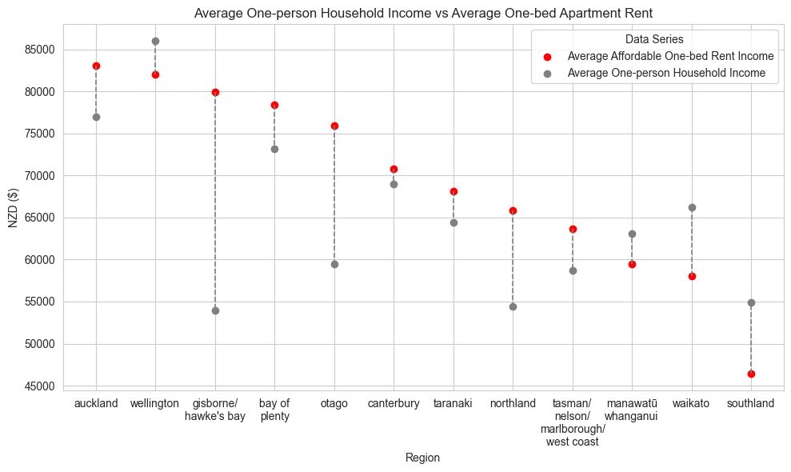
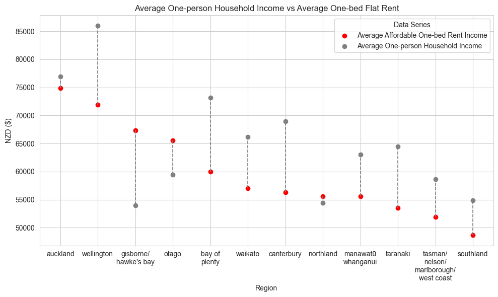

# `rent-affordability-nz`

- [`rent-affordability-nz`](#rent-affordability-nz-)
  - [1 - Description](#1---description)
  - [2 - Data](#2---data)
  - [3 - Method](#3---method)
  - [4 - Analysis](#4---analysis)

## 1 - Description
The Economist released this [article](https://www.economist.com/graphic-detail/2024/02/20/where-are-europes-most-expensive-cities-for-renters/) showing the most expense cities in europe for renters. I wanted to carry out a similar analysis for all regions in New Zealand using data from [Stats NZ](https://nzdotstat.stats.govt.nz/wbos/Index.aspx#) and [MBIE's Market Rent V2 API](https://portal.api.business.govt.nz/api-details?name=Market-Rent&version=v1&provider=mbiecreator#api=market-rent&operation=get-area-definitions-by-area-definition). We want to compare the rent of a one-bedroom flat in each region with individual income before tax to see how affordable different regions in NZ are. 
## 2 - Data
### 2.1 - MBIE Market Rent API V2
The market rent data was pulled from the api and put into a csv file (`rent_api_data.csv`). From this data we want to pull out rent data by region for 1-bed apartments and flats for the period ending 2023. MBIE distinguishes between the two with the following description:
- Apartment: A property with self-contained areas (eg, apartments or units) and shared areas (eg, lifts or driveways).
- Bedsit/Flat: Part of a subdivided building, or a building which is independent of the primary residence of a property (eg, a sleep-out).
### 2.2 - Stats NZ
Individual income data was pulled from Stats NZ for the year 2023. We filtered income for a one-person household across all regions.  
## 3 - Method
Using the guidelines from the Economist article we state that no more than 30% of an individuals pre-tax income should be spent on rent. Therefore we calculated the income needed to comfortably afford the average one-bedroom flat in each region. The is our "Affordable Renters Income". 
## 4 - Analysis

Below are two plots showing the average one-person household income compared to affordable renters income for different regions across New Zealand. One-bed apartments in many regions including Auckland are unaffordable and will likely take up more than 30% of peoples pre-tax income in those areas. One-person households in Wellington have a higher income on average which means it is just about affordable to rent an apartment there.  

Flats on the other hand are more affordable across the board with only 3 regions showing affordable renters income higher than one-person household income.

